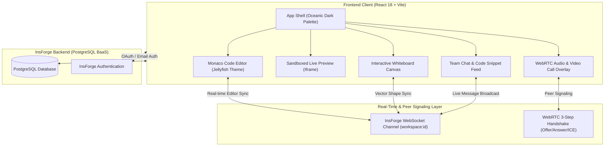

<div align="center">

# 🪼 CodeCanvas Live

### Next-Generation Full-Stack Collaborative Code Studio & Pair Programming Platform

[](https://react.dev/)
[](https://vitejs.dev/)
[](https://tailwindcss.com/)
[](https://insforge.dev/)
[](https://microsoft.github.io/monaco-editor/)
[](https://webrtc.org/)

<p align="center">
  <b>Real-Time Pair Programming</b> • <b>WebRTC Video & Audio Calls</b> • <b>Live Hot-Reloading Sandbox</b> • <b>Team Chat</b> • <b>Collaborative Whiteboard</b>
</p>

---

</div>

## 🌟 Overview

**CodeCanvas Live** is a production-ready, ultra-responsive collaborative IDE designed for engineering teams to build, edit, discuss, and preview web applications together in real time.

Powered by **React 18**, **Monaco Editor**, **Tailwind CSS**, **InsForge BaaS**, **PostgreSQL**, and **WebRTC**, CodeCanvas Live brings a friction-free pair programming environment right into your browser.

---

## 🏛️ System Architecture



---

## ✨ Key Features

| Feature | Description |
| :--- | :--- |
| 🪼 **Jellyfish Oceanic Theme** | Custom Monaco Editor theme featuring deep oceanic slate canvas (`#070A12`), Cyan carets (`#00E5FF`), Sky keywords (`#38BDF8`), Emerald strings (`#10B981`), and Coral accents (`#F43F5E`). |
| ⚡ **Live Preview Sandbox** | Hot-reloading iframe preview that automatically bundles `index.html`, `style.css`, and `script.js`, capturing console output in real time. |
| 📹 **WebRTC Video Calls** | Integrated video & audio channels with mute/unmute mic, camera toggle, screen sharing, and draggable PiP overlay. |
| 💬 **Real-Time Team Chat** | Slide-out messaging panel supporting text chat, code snippet formatting, timestamps, and active user presence badges. |
| 🎨 **Collaborative Whiteboard** | Freehand drawing, shapes (Rectangle, Circle, Arrow), text notes, color swatches, eraser, and PNG export synchronized live via WebSockets. |
| 🔒 **Role-Based Access Control** | Granular workspace permissions (`OWNER`, `EDITOR`, `VIEWER`) enforced across editor and backend database operations. |
| ✉️ **Dashboard & Email Invites** | Instant invitation system with 7-day token expiration, pending invitation cards on the dashboard, and one-click accept/decline actions. |

---

## 🗄️ PostgreSQL Database Schema

CodeCanvas Live uses **InsForge** PostgreSQL backend with strict UUID v4 primary keys:

```sql
-- 1. Users Table
CREATE TABLE users (
  id UUID PRIMARY KEY DEFAULT gen_random_uuid(),
  email TEXT UNIQUE NOT NULL,
  full_name TEXT,
  avatar_url TEXT,
  created_at TIMESTAMPTZ DEFAULT NOW()
);

-- 2. Workspaces Table
CREATE TABLE workspaces (
  id UUID PRIMARY KEY DEFAULT gen_random_uuid(),
  name TEXT NOT NULL,
  description TEXT,
  owner_id UUID REFERENCES users(id) ON DELETE CASCADE,
  created_at TIMESTAMPTZ DEFAULT NOW(),
  updated_at TIMESTAMPTZ DEFAULT NOW()
);

-- 3. Workspace Members Table
CREATE TABLE workspace_members (
  id UUID PRIMARY KEY DEFAULT gen_random_uuid(),
  workspace_id UUID REFERENCES workspaces(id) ON DELETE CASCADE,
  user_id UUID REFERENCES users(id) ON DELETE CASCADE,
  role TEXT CHECK (role IN ('OWNER', 'EDITOR', 'VIEWER')) DEFAULT 'EDITOR',
  joined_at TIMESTAMPTZ DEFAULT NOW()
);

-- 4. Workspace Invitations Table
CREATE TABLE workspace_invites (
  id UUID PRIMARY KEY DEFAULT gen_random_uuid(),
  workspace_id UUID REFERENCES workspaces(id) ON DELETE CASCADE,
  email TEXT NOT NULL,
  role TEXT CHECK (role IN ('EDITOR', 'VIEWER')) DEFAULT 'EDITOR',
  token UUID UNIQUE DEFAULT gen_random_uuid(),
  status TEXT CHECK (status IN ('PENDING', 'ACCEPTED', 'DECLINED')) DEFAULT 'PENDING',
  expires_at TIMESTAMPTZ,
  created_at TIMESTAMPTZ DEFAULT NOW()
);

-- 5. Files Table
CREATE TABLE files (
  id UUID PRIMARY KEY DEFAULT gen_random_uuid(),
  workspace_id UUID REFERENCES workspaces(id) ON DELETE CASCADE,
  name TEXT NOT NULL,
  language TEXT NOT NULL,
  content TEXT,
  created_at TIMESTAMPTZ DEFAULT NOW(),
  updated_at TIMESTAMPTZ DEFAULT NOW()
);
```

---

## 🚀 Quick Start Guide

### 1. Prerequisites
- Node.js (v18.0.0 or higher)
- npm or yarn

### 2. Clone & Install Dependencies
```bash
git clone https://github.com/LovelySharma-dev/CodeCanvas-Live.git
cd "CodeCanvas Live"
npm install
```

### 3. Configure Environment Variables
Create a `.env` file in the root directory:
```env
VITE_INSFORGE_BASE_URL=https://d7fwbe73.ap-southeast.insforge.app
VITE_INSFORGE_ANON_KEY=ik_631989c04f450a1cf7ec7997cfdc92ed
```

### 4. Run Development Server
```bash
npm run dev
```
Open [http://localhost:3000](http://localhost:3000) in your browser.

---

## ⚡ Production Build

To build for production:
```bash
npm run build
```

To preview production build locally:
```bash
npm run preview
```

---

## 🛠️ Tech Stack & Libraries

- **Frontend**: React 18, Vite 6, React Router v6
- **Styling**: Tailwind CSS 3.4, Lucide React Icons
- **Code Editor**: `@monaco-editor/react` with custom Jellyfish Theme
- **Backend & Auth**: InsForge TypeScript SDK (`@insforge/sdk`)
- **Database**: PostgreSQL (Managed via InsForge PostgREST API)
- **Realtime & WebRTC**: WebSockets Broadcast, HTML5 Canvas, WebRTC `MediaStream`

---

<div align="center">

Made with ❤️ by the **CodeCanvas Live Team**

</div>
